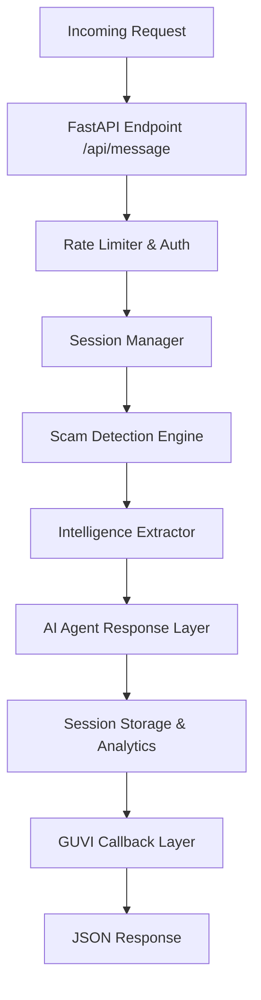

# Agentic Honey-Pot: Software Architecture & Logic Flow

**Version 5.3 "Neural Sentinel"** - This document outlines the internal architecture, layering, and robust logic of the Honey-Pot API.

## 🏗️ High-Level Architecture

The system is built as a modular, layered FastAPI application with **32+ Kill Switches** for high-confidence threat detection and advanced **Tactical Diversity Tracking**.

---

## 🛡️ Layer 1: Scam Detection Engine (`scam_detector.py`)

The detection engine uses a **Hybrid Scoring System** to classify messages. It doesn't rely on a single method but combines multiple signals to calculate a "Scam Confidence Score."

### 1. ML Classifier (60% Weight)
- **Technology**: TF-IDF Vectorization + Gradient Boosting Classifier.
- **Training**: Trained on a massive ultra-diverse dataset of 600,000+ samples (including 200k+ fresh 2024-2025 samples).
- **Logic**: Analyzes the lexical structure of the message to identify semantic patterns common in fraud across 10,000 unique features.

### 2. Rule-Based Pattern Matching (40% Weight)
- **Logic**: Extensive regex patterns for:
    - **Urgency**: "immediate", "within 24 hours", "turant".
    - **Threats**: "account blocked", "arrest warrant", "police".
    - **Financial**: "UPI", "KYC", "OTP", "Bank".
    - **Lures**: "Congratulations", "won prize", "lottery".

### 3. Kill-Switch Overrides (32 Total)
Certain patterns trigger immediate detection (Confidence = 0.85-1.0) regardless of AI/ML scores:

| # | Tier | Kill Switch | Target Pattern | Confidence |
|---|------|------------|----------------|------------|
| 1-13 | V1-V3 | Phishing, Digital Arrest, Job Scams, etc. | 0.90-1.0 |
| 14-19 | V4.0 | Pig Butchering, Honeytrap, Voice Clone, etc. | 0.90-1.0 |
| 20-24 | V5.0 | Stock Fraud, Welfare, Rent, Recharge, Election | 0.85-0.98 |
| 25-28 | V5.1 | Credit Rewards, FASTag, IT Refund, Religious | 0.90-0.98 |
| 29-32 | V5.2 | Hi Mom, Aadhaar, SBI YONO, EPF | 0.90-0.98 |

### 4. Novel Scam Synergies & Tactical Diversity (V5.3)
Specialized logic for identifying broad manipulation tactics without fixed categories:
- **Authority Trap**: Combines authority claims with a request for action (link/install).
- **Double Bait**: Uses reward lures paired with secrecy pressure to isolate the victim.
- **Isolation Pressure**: High time pressure + Secrecy + Authority.
- **Tactical Diversity Tracking**: `SessionManager` monitors the variety of `social_` markers using a **Strategy Pivot Detection** engine. If a scammer shifts tactics (e.g., from 'Support' to 'Police'), the system adapts its defense.

### 4. Scam Type Categories (24 Total)
The system classifies scams into specific categories for targeted engagement:
- Traditional: `Digital_Arrest_Scam`, `Sextortion_Blackmail`, `Job_Task_Scam`, etc.
- V4.0 Advanced: `Pig_Butchering_Scam`, `Honeytrap_Video_Sextortion`, `Voice_Cloning_Deepfake`, etc.
- **V5.0 Bharat Shield**: `Stock_Market_Fraud`, `Welfare_Scheme_Fraud`, `Rent_Property_Fraud`, `Free_Recharge_Fraud`, `Election_Voter_Fraud`

---

## 🔍 Layer 2: Intelligence Extraction (`intelligence_extractor.py`)

Once a potential scam is identified, the system attempts to harvest data from the scammer's messages.

- **UPI IDs**: Detects patterns like `fraud@paytm` or `payment@oksbi`.
- **Phone Numbers**: Extracts Indian formats (+91/0) with mobile validation.
- **Bank Details**: Matches account numbers (9-18 digits) with context verification.
- **Vehicle Numbers**: Extracts Indian plate formats (e.g., MH12AB1234) for RTO/Challan scams.
- **Employee/Agent IDs**: Captures fake credentials (e.g., AR7742) for impersonation tracking.
- **Crypto Wallets**: Detects Bitcoin, Ethereum, and USDT addresses.
- **Phishing Links**: Identifies short-URLs (bit.ly) and IP-based links with legitimacy filtering.

---

## 🤖 Layer 3: AI Agent Response Layer (`ai_agent.py`)

The bot replies using a **Multi-Model Fallback System** designed for 99.9% reliability.

### 1. Persona Steering
The agent adopts one of **12 specialized personas** (e.g., `busy_mom`, `eager_helper`, `college_student`). It features **Intelligent Identity Adoption**: if a scammer mentions a specific name (e.g., "Is this Ramesh?"), the system automatically adopts the matching pre-defined persona.

### 2. Indian Stalling Logic 2.0
The agent uses culturally specific stalling tactics:
- **"Slow Tech" Loop**: Feigning issues with OTPs, server down, or "spinning wheels".
- **Family Logic**: "My husband has the OTP phone", "Asking my son for english translation".
- **Casual Extraction**: Instead of interrogation, the bot asks for details (Address/Names) as part of "building trust" or "helping the officer".

### 3. Smart Key Rotation (Hierarchical)
To maximize uptime on free-tier keys, the system uses a **Two-Layer Retry Loop**:
1.  **Exhaustive Model Rotation**: It tries **ALL available models** (30+) in the queue with the current key.
2.  **Key Rotation Layer**: If *every single model* fails (indicating the key is dead/limited), it **Rotates the Key** and restarts the full model loop.
3.  **Instant Auth Failover**: If a 401/403 error occurs, it rotates the key *immediately*.
2. `Gemma-3`
3. `Mistral`
4. ...and so on.

### 3. Stalling Logic
The agent is explicitly prompted to:
- NEVER reveal it's an AI.
- Use **Hinglish** (Hindi + English) for realism.
- Use "Human" stalling excuses: "Doorbell is ringing", "Milk is boiling", "Phone battery is 1%".
- **Reverse-Verification**: Ask the scammer for *their* ID card or office address to waste their time.

---

## 🔄 Layer 4: Session & Callback Manager (`session_manager.py`)

- **State Persistence**: Tracks conversation history for up to 30 minutes.
- **Analytics**: Monitors "Scammer Frustration" and "Detection Risk".
- **Intelligent Plateau Completion**: Automatically stop the session and triggers the callback if:
    - Sufficient intelligence has been harvested (Quality > 0.7).
    - **Novel Tactic Plateau**: In novel scams, if no new tactics are seen for 5+ messages, learning is complete.
    - **Engagement Boredom**: If the scammer is disengaging or "bored" (short, infrequent replies).
    - **Detection Risk**: If risk of being detected as an AI bot exceeds 0.6.
    - The conversation exceeds 100 turns.
- **GUVI Callback**: Securely POSTs the final extracted intelligence to the hackathon's evaluation endpoint with custom retries and exponential backoff.

---

## 📈 Summary of Logic Flow
1. **Receive**: Message comes in with Session ID.
2. **Detect**: Hybrid engine checks if it's a scam.
3. **Extract**: Regex harvested links/phones/UPIs.
4. **Strategize**: Agent picks a persona and "stalling" goal.
5. **Generate**: OpenRouter/LLM produces a Hinglish reply.
6. **Report**: If enough data is found, a final report is sent to the evaluate endpoint.
